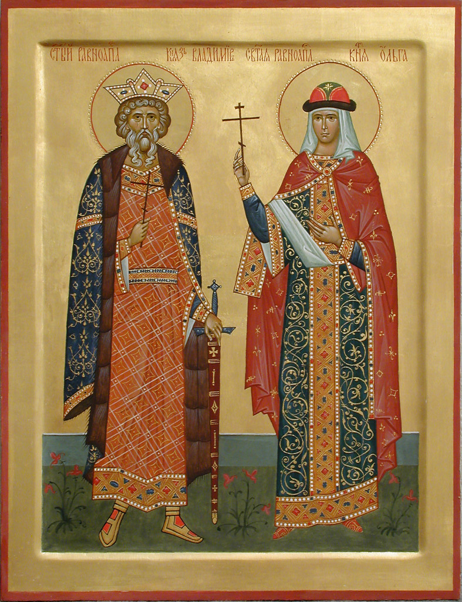

## О нас

---

#### Храм

Русский православный храм-памятник св. князя Владимира находится в юрисдикции Русской православной церкви
заграницей ([РПЦЗ](https://www.synod.com)).

Наш замечательный храм был построен к празднованию 1000-летия крещения Руси св. князем Владимиром.

#### Службы и праздники

По воскресным дням служится Божественная литургия.

Для детей прихожан нашего храма работает русская школа - дети изучают русский язык и
закон Божий.

После литургии по воскресным дням у нас трапеза - трудами сестричества и добровольцев.

Службы проводятся во все великие праздники православного календаря.

Кроме того, в течение года мы празднуем:

* **День св. Владимира** отмечаем в последнее воскресенье июля.
  В прошлом году праздник был в воскресенье 30 июля.
  Кроме Божественной литургии, освятили воду, играла музыка, прихожане и гости храма имели возможность приобрести сувениры, книги, иконы. Продавались шашлыки, лимонад, прожки. Казаки
  Филадельфии опять устроили "казачью заставу" - показ лошадей, выставку оружия. Дети катались на лошади и соревновались в стрельбе из лука.
* **Блины** - в воскресение перед великим постом. Праздничная трапеза обычно включает блины, рыбу, икру.
  Традиционная музыка, представления, различные игры и благотворительные лотереи.
  В этом году Блины были **25-го февраля 2024**.
  Приходите в следующем году поддержать Храм-Памятник. Милости просим!
* В этом году **8-12 октября 2025** мы будем принимать **32-ю ежегодную Конференцию Православной Церковной Музыки**! Певцы, регенты, композиторы и прихожане соберутся вместе для обмена идеями и опытом. Особое внимание на конференции уделяется молодежи. Планируются лекции, семинары и спевки. Традиции далекого прошлого и современные течения в музыке соединятся чтобы
  сохранить и приумножить литургическое наследие православия. Пожалуйста поддержите это событие
  [пожертвованием](#donate) и вашим участием.

